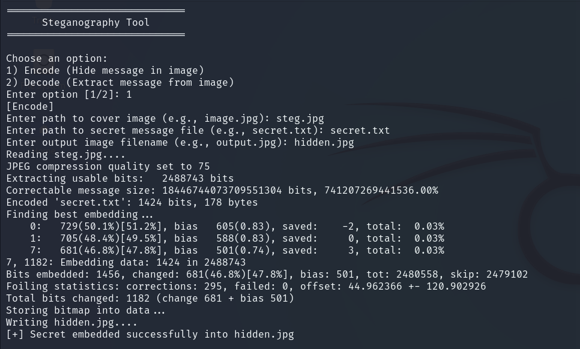
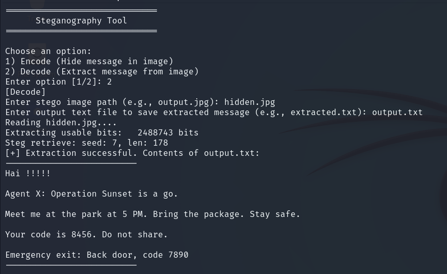

# 🛡️ StegnoSafe

**StegnoSafe** is a lightweight, terminal-based steganography tool for Linux that enables users to **hide and extract secret messages within image files** directly from the command line. Designed with simplicity and privacy in mind, it features a **menu-driven interface** to guide users through message embedding and retrieval—no deep technical knowledge required.

---

## ✨ Features

- 🔐 **Message Hiding & Extraction**  
  Seamlessly embed secret messages into image files and extract them later.

- 🧭 **Menu-Driven Workflow**  
  Navigate through encoding and decoding operations with a simple, interactive terminal interface.

- 🖼️ **Image Format Support**  
  Compatible with common image formats such as **JPEG**.

- 💡 **Beginner-Friendly**  
  Ideal for privacy enthusiasts, educators, and Linux users exploring digital confidentiality tools.

- 📦 **Offline & Private**  
  Works entirely offline—no internet connection or external APIs required.

---

## 📸 How It Works

### 🔐 Encoding (Hiding a Message)

To embed a message into an image, StegnoSafe requires:

- **Input Image** – The original image to hide the message in.
- **Message** – The text content to be hidden.
- **Output Image Name** – The name of the resulting encoded image file.

👉 After encoding, the image remains visually identical to the original.

### 🔓 Decoding (Extracting a Message)

To extract a hidden message from an image, StegnoSafe requires:

- **Encoded Image** – The image containing the hidden message.
- **Target Text File Name** – The name of the file where the extracted message will be saved.

---

## 🖥️ Screenshots

> Sample interface views of StegnoSafe’s guided terminal UI.

### Encoding Interface


### Decoding Interface


---

## 🛠 Requirements

- Linux (tested on Debian-based systems)
- `bash`, `dialog`, and basic image utilities (`file`, `imagemagick`, etc.)
- Steganography backend installed via package manager (see below)

---

## 🚀 Getting Started

1. **Install dependencies**:
   ```bash
   sudo apt update
   sudo apt install dialog imagemagick file [backend-tool-name]
